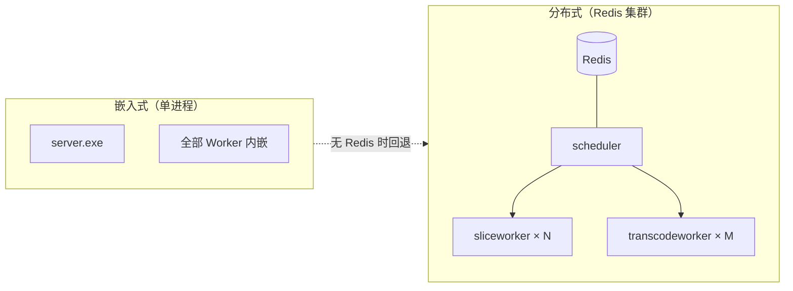
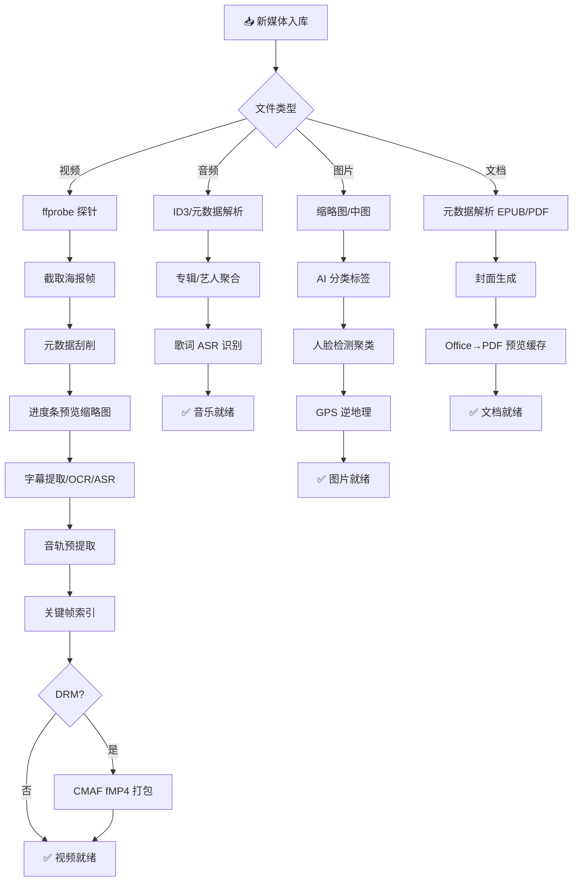
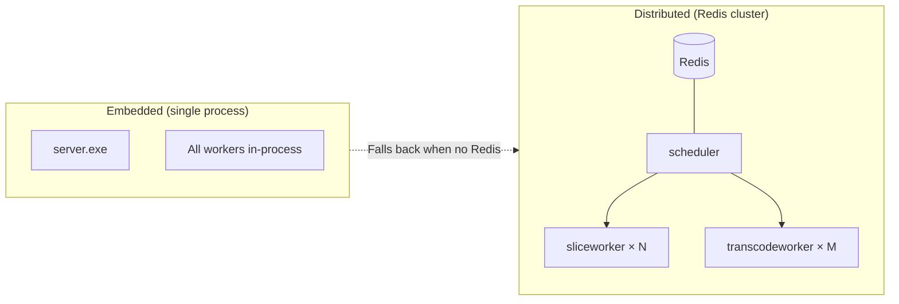
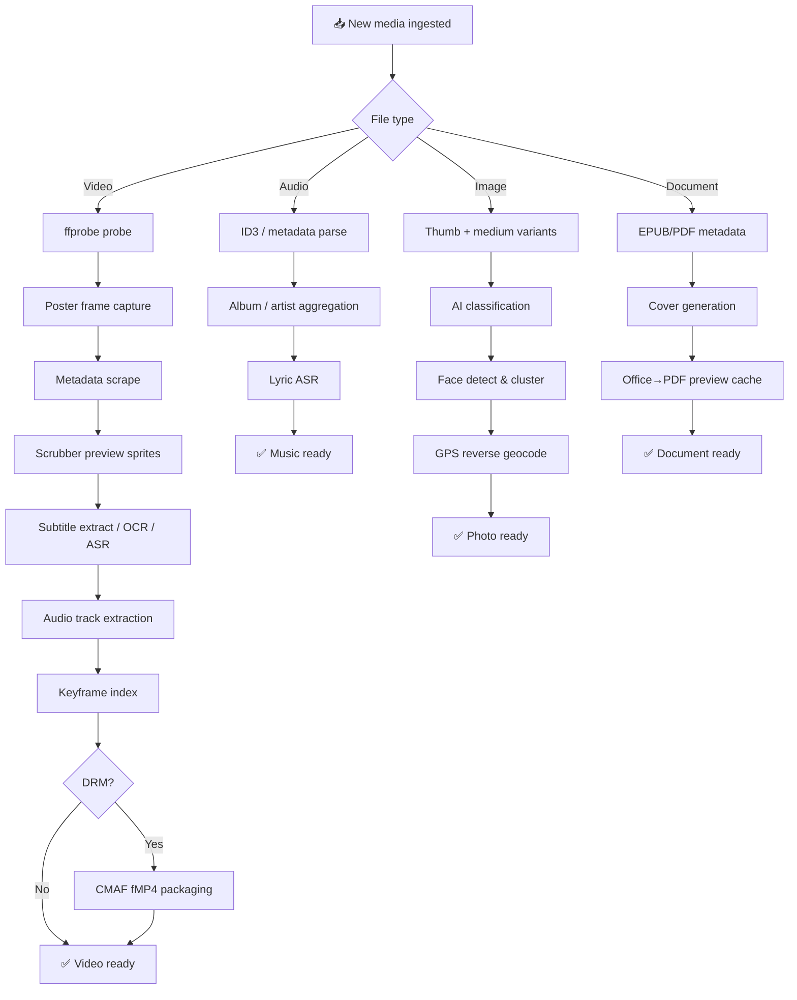

# Vauldy

**Vauldy · 轻量级家庭媒体服务器** / *Lightweight home media server — your keys, your data*

> 加密在你手里，密钥只有你知道。这不只是一款软件，这是你对自己数字生活的主权宣言。

Go · React · TypeScript · SQLite · Docker · [License](./LICENSE)

[中文](#中文) · [English](#english)

---

## 中文

**目录**：[项目简介](#项目简介) · [功能矩阵](#功能矩阵) · [系统架构](#系统架构) · [快速开始](#快速开始) · [已实现功能](#已实现功能) · [API 概览](#api-概览) · [开发计划](#开发计划) · [相关文档](#相关文档)

### 项目简介

**Vauldy** 采用 **Go + React** 构建，定位为轻量级家庭/个人媒体中心。加密在你手里，密钥只有你知道——系统可独立部署，也可作为微服务通过 REST API 供外部系统集成。


| 项目   | 说明                                            |
| ---- | --------------------------------------------- |
| 后端   | Go 1.22 · SQLite · Redis（可选）                |
| 前端   | React 19 · TypeScript · Vite 8                |
| 媒体引擎 | 内置转码与流媒体打包工具                              |
| 默认端口 | `8200`                                        |
| 运行环境 | Windows / Linux / macOS / Docker              |

---

### 功能矩阵


| 功能域      | 核心能力                                                      |
| -------- | --------------------------------------------------------- |
| 📁 媒体库   | 电影 · 剧集 · 动漫 · 音乐 · 图片 · 文档，多路径多库管理，各类型均有专属浏览/播放或阅读 UI    |
| ▶️ 播放引擎  | 直链 MP4 · HLS/DASH 自适应转码 · JIT 按需切片 · 音乐全局播放器 · 多播放器引擎自动切换 |
| 🔍 元数据刮削 | 多源在线刮削 · AI 大模型兜底                                       |
| 🔐 内容保护  | 内置 DRM · HLS AES-128 · 本地许可证服务                           |
| 🖼️ 预览图  | 进度条 sprite 缩略图 + WebVTT 时间线                               |
| 📝 字幕    | 内嵌轨提取 · Sidecar 扫描 · 图形 OCR · 语音识别字幕                    |
| 🎵 多音轨   | 音轨预提取，多音轨 HLS master playlist                             |
| 👥 用户管理  | 多角色 · 库级 ACL · 家长控制（分级+PIN+时段）                            |
| 🔒 安全    | JWT · OAuth 客户端凭证 · Bearer / Query Token 双模式              |
| 🛠️ 扩展   | 嵌入式部署 → Docker → 分布式 Redis 集群                             |


---

### 系统架构

#### 部署模式




#### 媒体入库流水线




#### 架构要点

1. **单体可部署**：`cmd/server` 嵌入前端静态资源（`web/dist`），一条命令即可启动完整服务。
2. **流水线式入库**：按文件类型自动排队——视频：海报 → 刮削 → 预览图 → 字幕 → 音轨/关键帧 →（可选）DRM；音乐：专辑聚合 → 歌词 ASR；图片：缩略图 → AI 分类 → 人脸/地点；文档：元数据 → 封面 → Office 转 PDF 预览。
3. **多层播放策略**：浏览器可直解的 MP4 走直链；不兼容格式走 HLS/DASH 自适应转码；高阶场景支持 JIT 按需切片与 DRM 加密流；音乐走独立全局播放器。
4. **分布式扩展（可选）**：Redis + `cmd/scheduler` + `cmd/sliceworker` + `cmd/transcodeworker` 组成即时转码集群；无 Redis 时回退到进程内 Session JIT（不依赖 Redis）。
5. **开放集成**：OAuth 客户端凭证、播放 URL 支持 `access_token` 查询参数，便于 HTML5 播放器与外部系统集成。

#### 目录结构

```
media/
├── cmd/
│   ├── server/           # 主服务入口
│   ├── scheduler/        # JIT 调度（Redis）
│   ├── schedulerd/       # 调度 daemon（独立进程）
│   ├── sliceworker/      # 分布式切片 Worker
│   ├── sliceworkerd/     # 切片 daemon（独立进程）
│   ├── transcodeworker/  # 分布式转码 Worker
│   └── transcodeworkerd/ # 转码 daemon（独立进程）
├── api/
│   ├── handler/          # REST 处理器（~68 文件）
│   ├── middleware/       # JWT 鉴权 · CORS
│   └── router.go
├── internal/
│   ├── scanner/          # 库扫描 · fsnotify 文件监控
│   ├── scraper/          # 多源元数据刮削
│   ├── tvparse/          # 剧集文件名解析
│   ├── tvstore/          # 剧集·季·集数据模型
│   ├── musicparse/       # 音乐文件名/ID3 解析
│   ├── musicstore/       # 专辑·艺人·流派聚合
│   ├── musiclyrics/      # 歌词解析（LRC/VTT）
│   ├── lyrictask/        # 歌词 ASR 识别任务
│   ├── photoparse/       # 图片 EXIF/GPS 解析
│   ├── photoclass/       # 图片 AI 分类（启发式/ONNX）
│   ├── photoface/        # 人脸检测与人物聚类
│   ├── photogeocode/     # GPS 逆地理（地点）
│   ├── imagethumb/       # 图片缩略图/中图生成
│   ├── docparse/         # 文档元数据（PDF/EPUB 等）
│   ├── doccover/         # 文档封面生成
│   ├── doctrans/         # Office→PDF 预览转换
│   ├── transcode/        # HLS 转码 & CMAF DRM 打包
│   ├── drm/              # 本地许可证服务
│   ├── jit/              # 即时转码（会话/调度/预加热/入库准备）
│   ├── preview/          # 进度条预览缩略图
│   ├── subtitle/         # 字幕流水线（提取/OCR/ASR）
│   ├── recognition/      # ASR/OCR 工具安装与探测
│   ├── atrack/           # 音轨提取
│   ├── keyframe/         # 关键帧索引
│   ├── upload/           # 分片上传服务
│   ├── monitor/          # 文件变更实时监控
│   ├── metadatalib/      # 刮削配图本地库
│   ├── mediautil/        # 编解码器兼容性检查
│   ├── config/           # YAML 配置加载
│   ├── store/            # SQLite schema & 迁移
│   ├── auth/             # JWT 生成与验证
│   └── model/            # 内部数据模型
├── pkg/
│   ├── ffprobe/          # FFprobe 封装
│   ├── fileutil/         # 文件类型/扩展名识别
│   └── hashutil/         # 哈希计算
├── web/                  # React 前端 SPA
│   └── src/
│       ├── pages/        # 首页 · 浏览 · 播放/阅读 · 管理 · 设置
│       ├── components/   # 音乐播放器 · 图片灯箱 · 剧集/音乐组件
│       └── i18n/         # 多语言（zh-CN/zh-TW/en/ja/ko）
├── tools/
│   ├── ffmpeg/bin/       # ffmpeg/ffprobe 二进制
│   ├── shaka-packager/   # 流媒体打包工具
│   ├── asr/              # 语音识别脚本
│   ├── subtitle_ocr/     # 图形字幕 OCR 脚本
│   ├── photo_classify/   # 图片分类模型
│   ├── photo_face/       # 人脸检测
│   └── doctran/           # 文档预览转换工具
├── data/                 # 运行时数据（数据库/缓存/上传）
├── config.yml            # 运行配置
├── Dockerfile
└── docker-compose.yml
```

---

### 快速开始

#### 环境准备

- Go 1.22+
- Node.js 20+（仅开发前端时需要）
- 媒体转码工具（可使用 `tools/download_media_tools.ps1` 下载内置二进制）

#### 配置关键项

首次部署前，编辑 `config.yml` 至少修改以下配置：

```yaml
security:
  jwt_secret: "change-me-in-production-use-long-random-string"  # ⚠️ 必改

ffmpeg:
  ffprobe_path: "tools/ffmpeg/bin/ffprobe.exe"   # Windows
  ffmpeg_path:  "tools/ffmpeg/bin/ffmpeg.exe"    # Linux: /usr/bin/ffmpeg

# 如需 DRM 加密
drm:
  widevine:
    enabled: false  # 需配置外部许可证服务
  powerdrm:
    enabled: true   # 内置自定义加密，开箱即用

# 音乐/图片/文档（可选，见 config.yml 默认值）
lyric:
  auto_on_scan: true          # 扫描后自动排队歌词 ASR
photo_classify:
  auto_on_scan: true          # 图片库 AI 分类
photo_face:
  auto_on_scan: true          # 图片库人脸聚类
doc_trans:
  enabled: true               # Office 文档转 PDF 预览
```

#### 开发模式

```powershell
# 后端（工作目录 = media/）
go run ./cmd/server

# 前端（另开终端）
cd web
npm install
npm run dev    # http://localhost:5173，API 代理到 :8200
```

#### 生产模式

```powershell
cd web && npm run build && cd ..
go build -o vauldy ./cmd/server
./vauldy    # 单端口提供 API + 静态前端
```

#### Docker

```bash
# 构建
docker build -t vauldy .

# 运行
docker run -d \
  --name vauldy \
  -p 8200:8200 \
  -v ./data:/app/data \
  -v /your/media:/media \
  vauldy
```

```yaml
# docker-compose.yml（项目自带）
version: "3.8"
services:
  vauldy:
    build: .
    ports:
      - "8200:8200"
    volumes:
      - ./data:/app/data
      - /your/media:/media          # 媒体文件目录
      - ./config.yml:/app/config.yml # 可选：挂载自定义配置
    environment:
      - MEDIA_CONFIG=/app/config.yml
    restart: unless-stopped
```

#### 首次使用

**默认演示账号**（首次启动自动创建，生产环境请立即修改）：

| 用户名      | 密码          | 角色   |
| -------- | ----------- | ---- |
| `admin`  | `admin123`  | 管理员  |
| `viewer` | `viewer123` | 普通用户 |

1. 浏览器访问 `http://localhost:8200`
2. 使用默认账号 `admin` / `admin123` 登录
3. 进入 **管理后台 → 媒体库**，创建媒体库（选择类型：电影/剧集等）
4. 为媒体库 **添加文件夹**（指向存放视频的目录，Docker 需确保路径已挂载）
5. 点击 **扫描**，系统将按库类型自动处理（示例：视频 → ffprobe + 刮削 + 预览图 + 字幕；音乐 → 专辑聚合 + 歌词任务；图片 → 缩略图 + 分类/人脸；文档 → 元数据 + 封面 + PDF 预览）
6. 扫描完成后返回首页，即可浏览、播放或阅读

---

### 已实现功能

#### 媒体库与扫描

- 支持库类型：**电影、剧集、动漫、其他影片、音乐、图片、文档**（均有专属浏览/播放或阅读界面；`other` 类型走通用文件列表）
- 多路径文件夹、启用/禁用、自动扫描、**实时文件监控**（fsnotify）
- 全量/增量扫描任务，扫描进度与取消；**扫描日志**查询（`/scan-logs`）
- 按扩展名识别 **video / audio / image / document**，视频走 ffprobe，文档走 EPUB/PDF 元数据解析
- **剧集文件名解析**（`S01E01`、`Season 1` 等模式），**剧集聚合浏览**（`/series/:id`）
- 季集视图：按系列分组、季选择、剧集列表展示
- 扫描性能选项：`fast_ffprobe`、可选文件哈希去重（`file_hash_on_scan`）

#### 元数据刮削

- 多源在线刮削与 **AI 大模型** 兜底
- 自动刮削（入库触发）与批量刮削任务
- 手动匹配/取消匹配、标题解析、在线配图搜索
- 刮削配图本地落盘（`metadata/library`），海报/背景/Logo 管理
- 剧集级刮削（按季集匹配系列元数据）

#### 播放体验

- **直链播放**（浏览器兼容的 MP4/H.264+AAC）
- **HLS / DASH 自适应转码**（多码率；DRM 场景可走 DASH）
- **JIT 即时转码**（Redis 集群或进程内 Session 双模式，支持 seek/pause/resume/end）
- 多种播放器引擎（按场景自动选择）
- 进度条 **预览缩略图**（sprite + WebVTT）
- 多音轨 HLS（可配置）、外挂/内嵌字幕 WebVTT 输出
- **断点续播**、已观看标记、播放历史与筛选

#### 内容保护

- 库级 `drm_enabled` 开关，CMAF fMP4 HLS 打包
- 内置 DRM 与 **HLS AES-128** 播放链路
- 内置许可证端点与管理端审计/验签调试接口
- 上传本地源文件打包后可选择性清理源文件（仅 upload 路径，不删挂载媒体）

#### 字幕与音轨

- 扫描时自动创建字幕任务：内嵌轨提取、同目录 sidecar（srt/ass/ssa/vtt/sub 等）
- 可选语音识别字幕、**PGS 图形字幕 OCR**
- 音轨预提取（独立 HLS 音轨，降低转码成本，支持多音轨切换）

#### 音乐模块

- 扫描入库：ID3/文件名解析，**专辑·艺人·流派**自动聚合（`musicstore`）
- 浏览 UI：**专辑 / 艺人 / 流派 / 曲目** 四 Tab，网格/表格视图，库内搜索与排序
- **专辑详情**（`/album/:id`）：曲目列表、封面、播放整张专辑
- **艺人详情**（`/artist/:id`）、**流派详情**（`/genre`）
- **全局音乐播放器**：底部 `MusicPlayerBar`、全屏播放器、播放队列与播放模式
- **歌词**：侧车 LRC/VTT 解析；无歌词时可排队 **ASR 歌词识别任务**（`lyric_task`）
- 曲目可加入播放列表、从首页/继续收听入口快速播放

#### 图片模块

- 扫描时生成 **缩略图 + 中图**（`imagethumb`），读取 EXIF 拍摄时间
- 浏览 UI：**时间轴**（按月分组）、网格/列表布局、关键词过滤
- **智能分类**：启发式色彩/场景标签 + 可选 AI 分类模型（`photo_classify`）
- **人物**：人脸检测与聚类，人物封面与重命名（`/library/:id/photo/persons`）
- **地点**：GPS 逆地理编码为中国省市/地标展示，支持批量回填
- **灯箱**预览：缩放、左右切换、标签编辑（`PATCH /media/:id/photo/tags`）
- 管理员可触发整库 **重新分类 / 地点回填 / 人脸回填**，任务进度可轮询

#### 文档模块

- 支持扩展名：PDF、EPUB、Office（doc/docx/xls/xlsx/ppt/pptx）、txt/md/html/csv/rtf、mobi/azw/azw3 等
- 扫描提取标题、作者、出版社、页数、标签等元数据；**封面**自动生成或从 EPUB 提取
- 浏览 UI：目录树、**作者/格式/标签/年份** 分面筛选、最近阅读、网格/列表视图
- **阅读器**（`/reader/:id`）：PDF、EPUB 在线阅读；Office 文档转 PDF 后在线预览
- **阅读进度**本地 + 服务端同步；主题/字号偏好；原文下载与批量打包下载
- 文本类（txt/md/html）流式阅读；Markdown 渲染

#### 用户端功能

- 首页：媒体库卡片、**继续观看/收听**、按类型分组的**最近添加**（含音乐封面与图片灯箱）
- 浏览：海报/缩略图/列表/表格多视图；按库类型自动切换 **剧集 / 音乐 / 图片 / 文档** 专属页
- 剧集库：按系列聚合展示，季集详情页
- 收藏、**播放列表**（支持排序与多图）、搜索（标题关键字）
- 个人设置：资料、密码、头像上传、播放器偏好、**界面语言**（zh-CN / zh-TW / en / ja / ko）
- **播放历史**（`/playback-history`）：按库类型筛选，支持清除进度

#### 上传与管理

- 单文件上传、**分片上传+合并**、上传目录创建
- 媒体资料管理（标题、元数据、配图 URL 编辑）
- 媒体删除（含关联任务/缓存清理计划）
- 管理员控制台：CPU/内存/磁盘实时概览、SSE 活动流

#### 管理后台

- 媒体库 CRUD、扫描控制与进度；图片库可一键 **排队全库 AI 分类**
- 任务中心：转码/预览/刮削/字幕/**歌词**/扫描/音轨/关键帧/定时任务
- **系统选项**（`/system-options`）：ASR/OCR/图片分类/人脸/文档转换 的检测、测试与一键安装
- 刮削配置（提供商开关与优先级）、AI 服务提供商配置
- 用户管理（角色/权限/库范围/家长控制）、API 凭证管理
- DRM 许可证审计、访问日志

#### 权限与安全

- 多用户（管理员/普通用户），**媒体库级 ACL**、文件夹级权限
- **家长控制**（分级上限 + PIN + 时段窗口 + 每日计划）
- JWT 会话、OAuth 客户端凭证（供外部播放集成）
- 访问日志、401/403 权限拦截前端提示

---

### API 概览

> 播放相关 URL 支持 Header `Authorization: Bearer` 或查询参数 `?access_token=`，便于 `<video>` / 外置播放器集成。完整路由见 `api/router.go`。

#### 认证与用户


| 端点                             | 鉴权    | 说明                    |
| ------------------------------ | ----- | --------------------- |
| `POST /api/v1/user/login`      | 无     | 用户登录，获取 JWT           |
| `POST /api/v1/oauth/token`     | OAuth | OAuth 客户端凭证换取 Token   |
| `GET /api/v1/user/info`        | JWT   | 当前用户信息                |
| `PUT /api/v1/user/profile`     | JWT   | 资料与 `ui_locale`、播放器偏好 |
| `GET /api/v1/playback-history` | JWT   | 播放历史列表                |


#### 浏览与元数据


| 端点                                         | 鉴权  | 说明            |
| ------------------------------------------ | --- | ------------- |
| `GET /api/v1/library`                      | JWT | 媒体库列表         |
| `GET /api/v1/media`                        | JWT | 媒体列表（库/排序/分页） |
| `GET /api/v1/series/:id`                   | JWT | 剧集系列详情        |
| `GET /api/v1/library/:id/albums`           | JWT | 音乐专辑列表        |
| `GET /api/v1/library/:id/artists`          | JWT | 音乐艺人列表        |
| `GET /api/v1/library/:id/tracks`           | JWT | 音乐曲目列表        |
| `GET /api/v1/library/:id/documents`        | JWT | 文档列表          |
| `GET /api/v1/library/:id/photo/categories` | JWT | 图片智能分类        |
| `GET /api/v1/library/:id/photo/persons`    | JWT | 图片人物聚类        |


#### 播放与 DRM


| 端点                                           | 鉴权        | 说明                   |
| -------------------------------------------- | --------- | -------------------- |
| `GET /api/v1/media/:id/play`                 | JWT/Token | 播放策略（直链/HLS/JIT/DRM） |
| `GET /api/v1/media/:id/hls/`*                | Token     | HLS 段与播放列表           |
| `GET /api/v1/media/:id/dash/`*               | Token     | DASH 资源（DRM 场景）      |
| `GET /api/v1/media/:id/preview/*`            | Token     | 进度条 sprite + WebVTT  |
| `GET /api/v1/media/:id/lyrics`               | JWT       | 歌词内容                 |
| `GET /api/v1/media/:id/photo/thumb.jpg`      | Token     | 图片缩略图                |
| `GET /api/v1/media/:id/document/preview.pdf` | Token     | 文档 PDF 预览            |
| `POST /api/v1/jit/session/:id/seek`          | Token     | JIT 会话跳转             |
| `POST /api/v1/drm/widevine/license`          | Token     | DRM 许可证              |


#### 管理


| 端点                                 | 鉴权    | 说明                  |
| ---------------------------------- | ----- | ------------------- |
| `POST /api/v1/library`             | Admin | 创建媒体库               |
| `POST /api/v1/library/:id/scan`    | Admin | 触发库扫描               |
| `GET /api/v1/admin/overview`       | Admin | 管理仪表盘               |
| `GET /api/v1/admin/system-options` | Admin | 系统选项（ASR/OCR/图片/文档） |
| `GET /api/v1/lyric/task`           | Admin | 歌词识别任务列表            |


> 其余管理端点（用户/任务/刮削/上传/DRM 审计等）均要求 **Admin** 角色。

---

### 开发计划

下表为待增强或规划中方向。


| 方向           | 状态      | 说明                                           |
| ------------ | ------- | -------------------------------------------- |
| 音乐模块         | ✅ 基础完成  | 专辑/艺人/流派/曲目、全局播放器、ASR 歌词；待增强：在线歌词源、电台、智能推荐 |
| 图片模块         | ✅ 基础完成  | 时间轴、AI 分类、人脸/地点；待增强：幻灯片放映、相册手工编排、RAW 深度预览  |
| 文档模块         | ✅ 基础完成  | 多格式入库、PDF/EPUB/Office 阅读、进度同步；待增强：全文检索、MOBI 原生渲染 |
| 界面多语言        | ✅ 基础完成  | 前端 zh-CN/zh-TW/en/ja/ko；待增强：管理端与错误文案全覆盖        |
| AI 刮削与 ASR 字幕 | ✅ 基础完成  | 多源刮削 + 语音识别；待增强：在线字幕源、刮削调度优化              |
| DRM 与内容保护    | ✅ 基础完成  | 内置 DRM 与 HLS AES-128；待增强：私有密钥策略、标准加密套件       |
| 目录变更适配       | 🔶 部分完成 | fsnotify 实时监控；待增强：路径迁移、批量重命名修复              |
| GPU 硬件加速     | 规划中     | NVENC/QSV/AMF/VAAPI 硬件转码                     |
| 客户端码率切换      | 规划中     | 播放端手动切换清晰度/码率                                |
| 转码结果缓存复用     | 规划中     | 同片同档位只转一次、缓存命中策略                             |
| 一键导入         | 规划中     | 从其他媒体库迁移库、NFO、进度与列表                          |
| 客户端 API 兼容   | 规划中     | 兼容主流第三方客户端接入协议                               |
| 直播与 IPTV     | 规划中     | M3U 源管理、频道列表、EPG 节目单与播放                     |
| DVR 录制       | 规划中     | 调谐器/IPTV 时移与预约录制                             |
| DLNA / 投屏    | 规划中     | DLNA 服务、无线投屏发现与控制                            |
| SyncPlay 同步观看 | 规划中     | 多用户同步播放进度与暂停                                 |
| 插件扩展         | 规划中     | 第三方插件安装与 API 钩子                              |
| 电影系列合集       | 规划中     | 系列归集浏览                                       |
| 在线字幕下载       | 规划中     | 在线搜索下载，补充侧车扫描与 ASR                          |
| 跳过片头片尾       | 规划中     | 片头/演职员表检测与一键跳过                               |
| 章节与精彩片段      | 规划中     | 章节标记、场景/精彩片段导航                               |
| 预告片与花絮       | 规划中     | 在线预告片、Extra 花絮轨                              |
| 播客与有声书       | 规划中     | Podcast RSS 订阅、有声书章节库                        |
| 智能播放列表       | 规划中     | 按规则自动更新的动态列表                                 |
| 观影记录同步       | 规划中     | 观看同步、关注列表、继续观看双向                             |
| Webhook 通知   | 规划中     | 扫描/转码/入库事件推送邮件与消息通道                          |
| 外部分享链接       | 规划中     | 只读分享链接，密码与过期时间                               |
| 服务端文件管理      | 规划中     | 库内浏览、重命名、批量移动、操作审计                           |
| 数据备份恢复       | 规划中     | 用户/库/配置 JSON 或 ZIP 导出导入                      |
| 观影统计看板       | 规划中     | 个人与全站观影时长、按日图表                               |
| Quick Connect | 规划中     | 配对码远程接入，免手填服务器地址                             |
| HDR 色调映射     | 规划中     | HDR10/DV 转 SDR 色调映射                           |
| AI 自然语言搜索    | 规划中     | 语义化检索，如「太空科幻片」                               |
| AI 智能重命名     | 规划中     | 刮削驱动的批量文件名规范化                                |
| AI 推荐理由      | 规划中     | 首页/详情个性化推荐文案                                 |
| AI 媒体库助手     | 规划中     | 对话式管理、批量重分类与异常诊断                             |
| 本地剪辑         | 规划中     | 片段裁剪、导出（浏览器或服务端）                             |
| 远程访问         | 规划中     | 公网/反向代理、HTTPS、外网安全播放                        |
| 高级检索         | 规划中     | 全文索引 + 演员/标签/类型筛选                            |
| 远程入库         | 规划中     | URL 离线下载、远程存储服务端                              |
| 存储协议         | 规划中     | 库路径抽象为 NFS/SMB/远程存储/S3（当前为本地或 OS 挂载路径）     |
| 数据库          | 规划中     | 可选关系型数据库后端（当前仅 SQLite）                       |
| NFO 双向同步     | 规划中     | 完整 NFO 读写与标准目录结构兼容                           |
| 访客角色与配额      | 规划中     | 只读访客、可配置用户数/并发数/带宽限速                         |
| 离线缓存下载       | 规划中     | 移动端/PWA 预约下载已转码文件                            |
| LDAP / SSO   | 规划中     | 企业目录单点登录                                     |
| 平台授权         | 规划中     | 集中授权与功能开关管理                                  |
| 分布式集群        | 规划中     | 与任务中心/独立转码服务深度集成（参见分布式集群部署文档）                |
| 多端终端         | 规划中     | Mobile/TV/PC 原生 App 或 PWA                    |


---

### 相关文档


| 文档                                                   | 用途              |
| ---------------------------------------------------- | --------------- |
| [FUNCTIONAL_TEST.md](./FUNCTIONAL_TEST.md)           | 功能回归测试清单        |
| [cmd/scheduler/README.md](./cmd/scheduler/README.md) | JIT 即时转码调度架构    |
| [分布式媒体处理于转码集群部署手册.MD](./docs/分布式媒体处理于转码集群部署手册.MD)    | 分布式转码集群部署（扩展模式） |


---

## English

**Contents**: [Overview](#overview) · [Feature Matrix](#feature-matrix) · [System Architecture](#system-architecture) · [Quick Start](#quick-start) · [Implemented Features](#implemented-features) · [API Overview](#api-overview) · [Roadmap](#roadmap)

### Overview

**Vauldy** is built with **Go + React** as a lightweight home/personal media server. Your keys, your data — it runs standalone or as a microservice exposing REST APIs for external integration.

> Encryption is in your hands; only you know the keys. This is not just software — it is a declaration of sovereignty over your digital life.


| Item         | Details                                       |
| ------------ | --------------------------------------------- |
| Backend      | Go 1.22 · SQLite · Redis (optional)           |
| Frontend     | React 19 · TypeScript · Vite 8                |
| Media stack  | Built-in transcode & streaming packaging tools |
| Default port | `8200`                                        |
| Platforms    | Windows / Linux / macOS / Docker              |

---

### Feature Matrix


| Domain         | Capabilities                                                                                   |
| -------------- | ---------------------------------------------------------------------------------------------- |
| 📁 Libraries   | Movies · TV · Anime · Music · Photos · Documents — each type has dedicated browse/play/read UI |
| ▶️ Playback    | Direct MP4 · HLS/DASH ABR · JIT transcode · Global music player · Multi-engine auto-select     |
| 🔍 Metadata    | Multi-source online scrape · AI LLM fallback                        |
| 🔐 DRM         | Built-in DRM · HLS AES-128 · local license service                  |
| 🖼️ Previews   | Sprite thumbnails + WebVTT timeline for scrubber                    |
| 📝 Subtitles   | Embedded extraction · Sidecar scan · bitmap OCR · speech-to-text    |
| 🎵 Multi-audio | Pre-extracted tracks, multi-audio HLS master playlist                                          |
| 👥 Users       | Multi-role · Library ACL · Parental controls (ratings+PIN+schedules)                           |
| 🔒 Security    | JWT · OAuth client credentials · Bearer / Query token dual mode                                |
| 🛠️ Scale      | Embedded → Docker → Distributed Redis cluster                                                  |


---

### System Architecture

#### Deployment Modes




#### Media Ingest Pipeline




#### Key Design Points

1. **Single-binary deployment** — `cmd/server` serves embedded frontend assets (`web/dist`).
2. **Ingest pipeline** — per file type: video poster→scrape→preview→subtitles→audio/keyframe→(optional) DRM; music album aggregation→lyric ASR; photo thumbs→classify→face/geo; document metadata→cover→Office→PDF preview.
3. **Tiered playback** — direct MP4 when browser-compatible; HLS/DASH ABR otherwise; JIT sessions; DRM encryption; dedicated global music player.
4. **Optional scale-out** — Redis-backed scheduler + slice/transcode workers; falls back to in-process session JIT when Redis is unavailable.
5. **Integration-friendly** — OAuth client credentials; playback URLs accept `access_token` query param for HTML5 players.

#### Project Layout

```
media/
├── cmd/
│   ├── server/           # Main entrypoint
│   ├── scheduler/        # JIT scheduler (Redis)
│   ├── schedulerd/       # Scheduler daemon (standalone)
│   ├── sliceworker/      # Distributed slice worker
│   ├── sliceworkerd/     # Slice daemon (standalone)
│   ├── transcodeworker/  # Distributed transcode worker
│   └── transcodeworkerd/ # Transcode daemon (standalone)
├── api/
│   ├── handler/          # REST handlers (~68 files)
│   ├── middleware/       # JWT auth · CORS
│   └── router.go
├── internal/
│   ├── scanner/          # Library scan · fsnotify file watcher
│   ├── scraper/          # Multi-source metadata scraping
│   ├── tvparse/          # TV filename parser
│   ├── tvstore/          # Series·season·episode models
│   ├── musicparse/       # Music filename / ID3 parser
│   ├── musicstore/       # Album · artist · genre aggregation
│   ├── musiclyrics/      # Lyric parsing (LRC/VTT)
│   ├── lyrictask/        # Lyric ASR tasks
│   ├── photoparse/       # Photo EXIF/GPS parser
│   ├── photoclass/       # Photo AI classify (heuristic/ONNX)
│   ├── photoface/        # Face detect & person clustering
│   ├── photogeocode/     # GPS reverse geocoding
│   ├── imagethumb/       # Photo thumb/medium generation
│   ├── docparse/         # Document metadata (PDF/EPUB, …)
│   ├── doccover/         # Document cover generation
│   ├── doctrans/         # Office→PDF preview conversion
│   ├── transcode/        # HLS transcode & CMAF DRM packaging
│   ├── drm/              # Local license service
│   ├── jit/              # On-demand transcode (session/schedule/preheat)
│   ├── preview/          # Scrubber sprite thumbnails
│   ├── subtitle/         # Subtitle pipeline (extract/OCR/ASR)
│   ├── recognition/      # ASR/OCR tool install & probe
│   ├── atrack/           # Audio track extraction
│   ├── keyframe/         # Keyframe indexing
│   ├── upload/           # Chunked upload service
│   ├── monitor/          # Real-time filesystem watcher
│   ├── metadatalib/      # Local artwork library
│   ├── mediautil/        # Codec compatibility checks
│   ├── config/           # YAML config loading
│   ├── store/            # SQLite schema & migrations
│   ├── auth/             # JWT generate & validate
│   └── model/            # Internal data models
├── pkg/
│   ├── ffprobe/          # FFprobe wrapper
│   ├── fileutil/         # File type / extension detection
│   └── hashutil/         # Hash utilities
├── web/                  # React SPA frontend
│   └── src/
│       ├── pages/        # Home · Browse · Play/Read · Admin · Settings
│       ├── components/   # Music player · photo lightbox · TV/music widgets
│       └── i18n/         # Locales: zh-CN, zh-TW, en, ja, ko
├── tools/
│   ├── ffmpeg/bin/       # ffmpeg/ffprobe binaries
│   ├── shaka-packager/   # Streaming packaging tool
│   ├── asr/              # Speech recognition scripts
│   ├── subtitle_ocr/     # Bitmap subtitle OCR scripts
│   ├── photo_classify/   # Image classification model
│   ├── photo_face/       # Face detection
│   └── doctran/           # Document preview conversion tool
├── data/                 # Runtime data (DB/caches/uploads)
├── config.yml            # Runtime configuration
├── Dockerfile
└── docker-compose.yml
```

---

### Quick Start

#### Prerequisites

- Go 1.22+
- Node.js 20+ (frontend dev only)
- Media transcode tools (`tools/download_media_tools.ps1` downloads bundled binaries on Windows)

#### Key Configuration

Edit `config.yml` before first deployment — at minimum:

```yaml
security:
  jwt_secret: "change-me-in-production-use-long-random-string"  # ⚠️ Required

ffmpeg:
  ffprobe_path: "tools/ffmpeg/bin/ffprobe.exe"   # Windows
  ffmpeg_path:  "tools/ffmpeg/bin/ffmpeg.exe"    # Linux: /usr/bin/ffmpeg

# For DRM encryption
drm:
  widevine:
    enabled: false  # Requires external license service
  powerdrm:
    enabled: true   # Built-in custom encryption, works out-of-box
```

#### Development

```powershell
go run ./cmd/server          # from media/

cd web && npm install && npm run dev   # http://localhost:5173 → proxies API to :8200
```

#### Production

```powershell
cd web && npm run build && cd ..
go build -o vauldy ./cmd/server
./vauldy
```

#### Docker

```bash
# Build
docker build -t vauldy .

# Run
docker run -d \
  --name vauldy \
  -p 8200:8200 \
  -v ./data:/app/data \
  -v /your/media:/media \
  vauldy
```

```yaml
# docker-compose.yml (included in repo)
version: "3.8"
services:
  vauldy:
    build: .
    ports:
      - "8200:8200"
    volumes:
      - ./data:/app/data
      - /your/media:/media          # Your media files
      - ./config.yml:/app/config.yml # Optional: custom config
    environment:
      - MEDIA_CONFIG=/app/config.yml
    restart: unless-stopped
```

Config file: `config.yml` (override path with `MEDIA_CONFIG` env var).

#### First Use

**Default demo accounts** (seeded on first boot — change in production):

| Username | Password    | Role          |
| -------- | ----------- | ------------- |
| `admin`  | `admin123`  | Administrator |
| `viewer` | `viewer123` | Regular user  |

1. Open `http://localhost:8200` in a browser
2. Login with `admin` / `admin123`
3. Go to **Admin Console → Libraries**, create a library (movie / TV / anime)
4. **Add folders** pointing to your video directories (Docker: ensure paths are mounted)
5. Click **Scan** — processing depends on library type (e.g. video: ffprobe + scrape + previews + subtitles; music: album aggregation + lyrics; photos: thumbs + classify/faces; documents: metadata + cover + PDF preview)
6. Return to Home once scanning finishes — browse, play, or read

---

### Implemented Features

#### Libraries & Scanning

- Library types: **movies, TV, anime, general video, music, photos, documents** — each has dedicated browse/play/read UI (`other` falls back to a flat file list)
- Multi-folder paths, enable/disable, auto-scan, **real-time filesystem watch** (fsnotify)
- Full & incremental scan tasks with progress, cancel, and **scan logs** (`/scan-logs`)
- Detects **video / audio / image / document** by extension; ffprobe for video, EPUB/PDF parsers for documents
- **Episode filename parsing** (`S01E01`, `Season 1`, …) and **series aggregation** (`/series/:id`) with season/episode detail views
- Scan tuning: `fast_ffprobe`, optional per-file MD5 hashing (`file_hash_on_scan`)

#### Metadata Scraping

- Multi-source online scraping plus **AI LLM** fallback
- Auto-scrape on ingest and batch scrape tasks
- Manual match/unmatch, title parsing, online artwork search
- Local artwork storage; poster / backdrop / logo management
- TV episode-level scraping tied to series metadata

#### Playback

- **Direct progressive** playback for browser-friendly MP4
- **HLS / DASH adaptive transcode** (multi-bitrate; DASH for some DRM paths)
- **JIT on-demand transcode** (Redis cluster or in-process sessions; seek/pause/resume/end)
- Multiple player engines (auto-selected per scenario)
- **Preview thumbnails** on the progress bar (sprite + WebVTT)
- Multi-audio HLS (configurable); embedded & external subtitles as WebVTT
- **Resume progress**, watched state, playback history with filtering

#### Content Protection

- Per-library `drm_enabled`; CMAF fMP4 HLS packaging
- Built-in DRM and **HLS AES-128** playback paths
- Built-in license endpoints; admin audit & license verification tools
- Optional local-source cleanup after packaging (upload-origin files only)

#### Subtitles & Audio

- Auto subtitle tasks on scan: embedded track extract, sidecar files (srt/ass/ssa/vtt/sub/…)
- Optional speech-to-text subtitles and **PGS bitmap OCR**
- Pre-extracted audio tracks for cheaper video-only HLS segments, multi-track switching

#### Music Module

- Scan: ID3/filename parsing with **album · artist · genre** aggregation (`musicstore`)
- Browse UI: **albums / artists / genres / tracks** tabs, grid/table views, in-library search & sort
- **Album detail** (`/album/:id`), **artist** (`/artist/:id`), **genre** (`/genre`) pages
- **Global music player**: bottom bar, fullscreen player, queue & play modes
- **Lyrics**: sidecar LRC/VTT; **ASR lyric tasks** when no lyrics exist (`lyric_task`)
- Add tracks to playlists; play from home / continue listening

#### Photo Module

- Scan generates **thumb + medium** variants (`imagethumb`) and reads EXIF capture time
- Browse UI: **timeline** (by month), grid/list layouts, keyword filter
- **Smart classify**: heuristics + optional AI classification model (`photo_classify`)
- **People**: face detect & cluster, rename persons, face thumbnails
- **Places**: GPS reverse geocode (China regions), batch backfill
- **Lightbox** with navigation and tag editing (`PATCH /media/:id/photo/tags`)
- Admins can enqueue library-wide re-classify / location / face backfill with progress polling

#### Document Module

- Extensions: PDF, EPUB, Office (doc/docx/xls/xlsx/ppt/pptx), txt/md/html/csv/rtf, mobi/azw/azw3, …
- Scan extracts title, author, publisher, pages, tags; auto **cover** from file or EPUB
- Browse UI: folder tree, **author/format/tag/year** facets, recent reads, grid/list
- **Reader** (`/reader/:id`): online PDF/EPUB reading; Office documents converted to PDF for preview
- **Read progress** (local + server), theme/font prefs, original download & batch zip
- Text/markdown/html streaming read with Markdown rendering

#### End-User Features

- Home: library cards, **continue watching/listening**, **recently added** by media type (music art, photo lightbox)
- Browse: poster/thumb/list/table; auto-routes to **TV / music / photo / document** views per library type
- TV libraries: series grid and season/episode detail pages
- Favorites, **playlists** (sortable, multi-image), title keyword search
- Settings: profile, password, avatar, player prefs, **UI locale** (zh-CN / zh-TW / en / ja / ko)
- **Playback history** (`/playback-history`) with per-type filters and progress clear

#### Upload & Administration

- Single-file upload, **chunked upload + merge**, mkdir under library root
- Media metadata editor (title, fields, image URLs)
- Deletion with related task/cache cleanup plan
- Admin console: real-time CPU/memory/disk overview, SSE activity stream

#### Admin Console

- Library CRUD & scan control; enqueue **full-library photo classify** for photo libraries
- Task manager: transcode / preview / scrape / subtitle / **lyrics** / scan / audio / keyframe / scheduled
- **System options** (`/system-options`): probe, test, and one-click install for ASR/OCR/photo classify/face/doc conversion
- Scrape config (provider toggles & priority), AI service provider config
- User management (roles / permissions / library scope / parental controls), API credentials
- DRM license audit, access logs

#### Security & Access Control

- Multi-user (admin / regular), **per-library ACL**, per-folder permissions
- **Parental controls** (rating limits + PIN + time windows + daily schedules)
- JWT sessions; OAuth client credentials for external players
- Access logs; frontend permission-error prompts for 401/403

---

### API Overview

> Playback URLs accept `Authorization: Bearer` or `?access_token=` for HTML5 players. See `api/router.go` for the full route table.

#### Auth & User


| Endpoint                       | Auth  | Description                        |
| ------------------------------ | ----- | ---------------------------------- |
| `POST /api/v1/user/login`      | None  | User login, returns JWT            |
| `POST /api/v1/oauth/token`     | OAuth | OAuth client credentials → token   |
| `GET /api/v1/user/info`        | JWT   | Current user profile               |
| `PUT /api/v1/user/profile`     | JWT   | Profile, `ui_locale`, player prefs |
| `GET /api/v1/playback-history` | JWT   | Playback history                   |


#### Browse & Metadata


| Endpoint                                | Auth | Description                       |
| --------------------------------------- | ---- | --------------------------------- |
| `GET /api/v1/library`                   | JWT  | List media libraries              |
| `GET /api/v1/media`                     | JWT  | Media list (filter/sort/paginate) |
| `GET /api/v1/series/:id`                | JWT  | TV series detail                  |
| `GET /api/v1/library/:id/albums`        | JWT  | Music albums                      |
| `GET /api/v1/library/:id/documents`     | JWT  | Documents                         |
| `GET /api/v1/library/:id/photo/persons` | JWT  | Photo person clusters             |


#### Playback & DRM


| Endpoint                                     | Auth      | Description                        |
| -------------------------------------------- | --------- | ---------------------------------- |
| `GET /api/v1/media/:id/play`                 | JWT/Token | Playback plan (direct/HLS/JIT/DRM) |
| `GET /api/v1/media/:id/hls/`*                | Token     | HLS segments & playlists           |
| `GET /api/v1/media/:id/dash/`*               | Token     | DASH assets (DRM)                  |
| `GET /api/v1/media/:id/lyrics`               | JWT       | Lyrics content                     |
| `GET /api/v1/media/:id/document/preview.pdf` | Token     | Document PDF preview               |
| `POST /api/v1/jit/session/:id/seek`          | Token     | JIT session seek                   |
| `POST /api/v1/drm/widevine/license`          | Token     | DRM license                        |


#### Admin


| Endpoint                           | Auth  | Description                    |
| ---------------------------------- | ----- | ------------------------------ |
| `POST /api/v1/library`             | Admin | Create library                 |
| `POST /api/v1/library/:id/scan`    | Admin | Trigger scan                   |
| `GET /api/v1/admin/overview`       | Admin | Dashboard                      |
| `GET /api/v1/admin/system-options` | Admin | ASR/OCR/photo/doc tool options |
| `GET /api/v1/lyric/task`           | Admin | Lyric recognition tasks        |


> Remaining admin endpoints (users / tasks / scrape / upload / DRM audit / …) require the **Admin** role.

---

### Roadmap

Planned enhancements and future directions. See **Implemented Features** above for what already ships.

| Area                       | Status          | Description                                                                                    |
| -------------------------- | --------------- | ---------------------------------------------------------------------------------------------- |
| Music module               | ✅ Baseline done | Albums/artists/genres/tracks, global player, ASR lyrics; next: online lyric sources, radio, recommendations |
| Photo module               | ✅ Baseline done | Timeline, AI tags, faces/places; next: slideshow, manual albums, deep RAW preview              |
| Document module            | ✅ Baseline done | Multi-format ingest, PDF/EPUB/Office read, progress sync; next: full-text search, native MOBI render |
| UI i18n                    | ✅ Baseline done | Frontend zh-CN/zh-TW/en/ja/ko; next: full admin & error string coverage                         |
| AI scrape & ASR subtitles  | ✅ Baseline done | Multi-source scrape + speech recognition; next: online subtitle sources, scheduler tuning       |
| DRM & content protection   | ✅ Baseline done | Built-in DRM & HLS AES-128; next: private key policies, standard encryption suite               |
| Directory change adapt     | 🔶 Partial      | fsnotify watch; next: path migration, bulk rename repair                                       |
| GPU acceleration           | Planned         | NVENC/QSV/AMF/VAAPI hardware transcode                                                         |
| Client bitrate switch      | Planned         | Manual quality/bitrate selection in player                                                      |
| Transcode cache reuse      | Planned         | Reuse prior transcode outputs per title/quality                                                 |
| One-click import           | Planned         | Migrate libraries, NFO, progress, and playlists from other media servers                        |
| Client API compatibility   | Planned         | Support mainstream third-party client protocols                                                 |
| Live TV & IPTV             | Planned         | M3U sources, channel grid, EPG                                                                 |
| DVR recording              | Planned         | Tuner/IPTV time-shift and scheduled recording                                                   |
| DLNA & casting             | Planned         | DLNA server and wireless casting discovery/control                                              |
| SyncPlay                   | Planned         | Synchronized multi-user playback                                                                |
| Plugin extensions          | Planned         | Third-party plugins and API hooks                                                               |
| Movie collections          | Planned         | Series collection browsing                                                                      |
| Online subtitle download   | Planned         | Online search/download beyond sidecar + ASR                                                     |
| Skip intro/credits         | Planned         | Intro/credits detection and one-tap skip                                                        |
| Chapters & highlights      | Planned         | Chapter markers and scene/highlight navigation                                                  |
| Trailers & extras          | Planned         | Online trailers and bonus/extra tracks                                                          |
| Podcasts & audiobooks      | Planned         | Podcast RSS and audiobook libraries                                                             |
| Smart playlists            | Planned         | Rule-based dynamic playlists                                                                    |
| Watch history sync         | Planned         | Scrobble, watchlists, continue-watching sync                                                     |
| Webhook notifications      | Planned         | Scan/transcode/ingest events to email and messaging channels                                    |
| External share links       | Planned         | Read-only shares with password and expiry                                                       |
| Server file manager        | Planned         | In-library browse, rename, bulk move, audit log                                                 |
| Backup & restore           | Planned         | Export/import settings and user data as JSON/ZIP                                                |
| Viewing statistics         | Planned         | Per-user and global watch-time charts                                                           |
| Quick Connect              | Planned         | Pairing-code remote access without manual URL                                                   |
| HDR tone mapping           | Planned         | HDR10/DV to SDR tone mapping                                                                    |
| AI natural-language search | Planned         | Semantic queries e.g. “space sci-fi movies”                                                     |
| AI smart rename            | Planned         | Scrape-driven batch filename normalization                                                      |
| AI recommendation copy     | Planned         | Personalized blurbs on home/detail pages                                                        |
| AI library assistant       | Planned         | Chat-style admin: reclassify, diagnose, bulk fixes                                              |
| Local clip editor          | Planned         | Trim/export clips (browser or server-side)                                                      |
| Remote access              | Planned         | Public reach, reverse proxy, HTTPS, secure external playback                                      |
| Advanced search            | Planned         | Full-text index + cast/genre/tag filters                                                        |
| Remote ingest              | Planned         | URL download, remote storage server                                                             |
| Storage backends           | Planned         | First-class NFS / SMB / remote storage / S3 paths (today: local or OS mounts)                   |
| Database                   | Planned         | Optional relational database backend (SQLite only today)                                        |
| NFO sync                   | Planned         | Full read/write NFO with standard folder compatibility                                          |
| Guest role & quotas        | Planned         | Read-only guest; configurable user/concurrency/bandwidth limits                               |
| Offline download           | Planned         | Mobile/PWA scheduled download of transcoded files                                               |
| LDAP / SSO                 | Planned         | Enterprise directory login                                                                      |
| Platform licensing         | Planned         | Centralized license and feature flag management                                                 |
| Distributed cluster        | Planned         | Task center / standalone transcode fleet integration                                            |
| Multi-device clients       | Planned         | Mobile/TV/PC native apps or PWA                                                                 |


---

[↑ 中文](#中文) · [↑ English](#english)